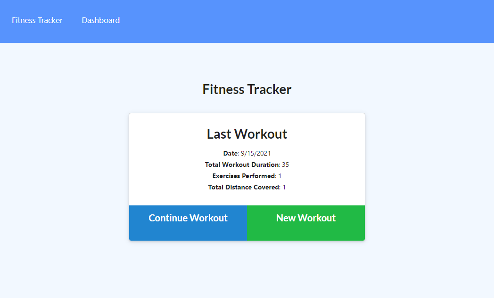

# Workout Tracker

## Description

An application that allows a user to enter their workout data in order to track their fitness progress. Created with MongoDB and Express.

[Deployed Application](https://workout-tracker-sprest4.herokuapp.com/)

[GitHub Repo](https://github.com/spreston4/workout-tracker)

## Technologies Used

Built in Visual Studio with:
* Node.js
* Express
* MondoDB
* Mongoose

## How To

When the application loads, the user is presented with the following landing screen. They are given the option to continue an existing workout or create a new workout.

Selecting either option will prompt the user to add exercise data for their workout. First the user will select the type of exercise - they are presented with the choice of resistance or cardio. Once an option is selected, the user is prompted to enter information specific to their selected workout type.

After entering their exercise information, the user can select 'Complete' or 'Add Exercise'. Selecting 'Complete' will finish the user's workout. Selecting 'Add Exercise' will allow the user to add an additional exercise to their workout.

Once a workout has been completed, the user can navigate to their Dashboard to view workout statistics. From the Dashboard, users can see the total workout duration, and pounds lifted, for their last 7 workouts.

## User Story

As a user, I want to be able to view create and track daily workouts. I want to be able to log multiple exercises in a workout on a given day. I should also be able to track the name, type, weight, sets, reps, and duration of exercise. If the exercise is a cardio exercise, I should be able to track my distance traveled.

## Acceptance Criteria

When the user loads the page, they should be given the option to create a new workout or continue with their last workout.

The user should be able to:

* Add exercises to the most recent workout plan.

* Add new exercises to a new workout plan.

* View the combined weight of multiple exercises from the past seven workouts on the stats page.

* View the total duration of each workout from the past seven workouts on the stats page.

## Contact Me

Contact me via e-mail, or check out my GitHub!

* GitHub: [spreston4](https://github.com/spreston4)
* E-mail: [sam.preston11@gmail.com](mailto:sam.preston11@gmail.com)
